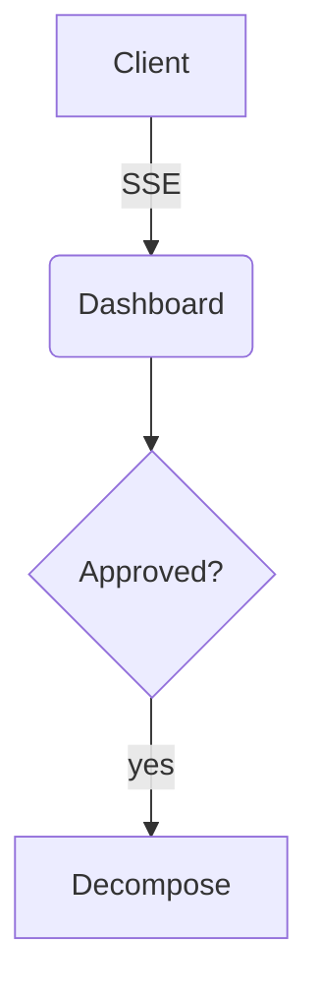
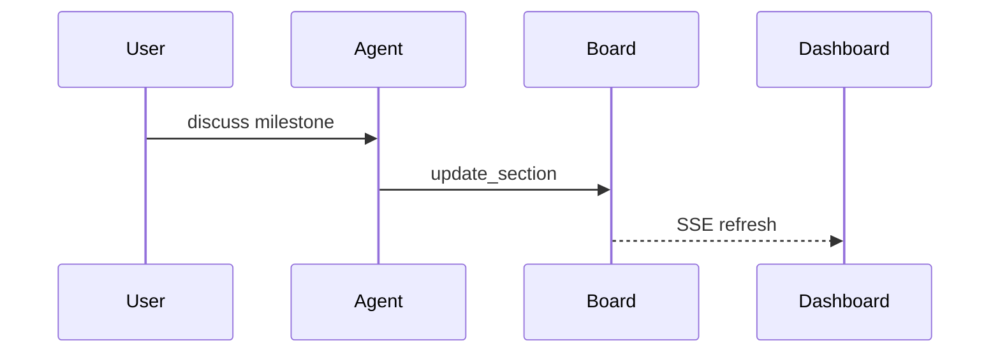
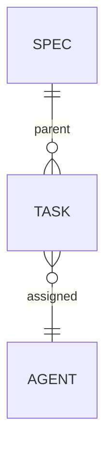

# Spec-Driven Development flow (live plan)

This is the canonical pipeline for "user has an idea or external board card → holoctl makes it executable". The spec ticket is created **early** and its body is authored **live** during the discussion — the user watches the plan grow in the dashboard while approval happens in chat:

```
External source (Trello/Linear/Azure/Jira/GitHub/Slack/manual)
     │
     ▼  user pastes content (or future MCP fetches it)
   /spec  ← entry point
     │
     ▼
 1. Intake — detect source_provider/ref/url/label
 2. Materialize EARLY — board_create({kind:'spec'}) + skeleton body + status doing
 3. Serve & link — ensure the dashboard is up, hand the user the live URL
 4. Live authoring loop — discuss in chat; board_update_section after each milestone
 5. Review gate — board_move(review) + ask for verbal approval in chat
 6. Decompose — parallel-evaluator + boardmaster + board_batch({shared:{parent:SPEC_ID}})
 7. Execute — activate developer/reviewer subagents on the first child task
```

## When to trigger

Fires automatically (auto-trigger via description) when the user:

- Pastes a card-like block (with terms like "as a user", "I want", "story:", "acceptance:") OR
- Pastes a URL from a known external board (see `holoctl-work-item-router` for patterns) OR
- Shares a multi-paragraph request describing work that touches multiple files / modules OR
- Explicitly says "vou trabalhar nessa" / "tem esse card aqui" / "vamos planejar essa feature"

Doesn't fire for:

- One-line bug reports → that's a single ticket (`/ticket` or `kind=bug`)
- Already-decomposed work where tasks are explicit → that's batch `/ticket`

## Step-by-step

### 1. Intake

Read what the user pasted. Extract:

- **source_provider** — see `holoctl-work-item-router` URL patterns.
- **source_ref** / **source_url** / **source_label** when present.
- **Raw request body** — the prose itself.

If a URL is given but no body, ask the user to paste the body (until the provider has an MCP we can fetch from).

### 2. Materialize EARLY

Create the spec **before** the deep discussion, with whatever is already known:

```
mcp__holoctl__board_create({
  "title": "<spec title — verb + object, derived from source>",
  "kind": "spec",
  "agent": "architect",
  "priority": "<inferred or default p1>",
  "source_provider": "<provider>", "source_ref": "<ref>",
  "source_url": "<url>", "source_label": "<label>"
})
```

Save the returned ID as `SPEC_ID`, move it to writing state, and lay down the section skeleton (empty sections stay hidden in the dashboard until written, so the document grows visually as the discussion advances):

```
mcp__holoctl__board_move({"id": SPEC_ID, "status": "doing"})
mcp__holoctl__board_set_body({"id": SPEC_ID, "body":
  "# Context\n\n# Goals\n\n# Architecture\n\n# Diagrams\n\n# Decisions\n\n# Risks\n\n# Open questions\n\n# Proposed ticket breakdown\n"})
```

### 3. Serve & link

Hand the user a ready-to-click live URL right after creating the spec:

1. Health-check the dashboard: `curl -s --max-time 2 http://127.0.0.1:4242/api/projects` (4242 is `hctl serve`'s default port; if the user runs a custom port, use the one that answers).
2. No answer → start it in the background (`hctl serve` is blocking): run it as a background shell task (e.g. `nohup hctl serve >/dev/null 2>&1 &`), wait ~2s, re-check.
3. Resolve the project alias from the `/api/projects` payload (match `path` against the project root; the default alias is the root directory name).
4. Tell the user: `→ Watch the plan live: http://localhost:4242/project/<alias>/board/<SPEC_ID>`

### 4. Live authoring loop

Discuss scope, acceptance, files, edge cases, risks in chat — and reflect every **milestone** (a decision closed, a question answered, the architecture settled — NOT every message) into the spec body:

```
mcp__holoctl__board_update_section({"id": SPEC_ID, "heading": "Architecture",
  "content": "- queue lives in the board dir\n- SSE fans out updates\n..."})
```

- `Open questions` is a living list: when one is resolved, remove it there and record the outcome under `Decisions`.
- Acceptance criteria go into the body as `- [ ]` checkboxes (the board counts them automatically).
- Diagrams are ```mermaid fences under `Diagrams` — the dashboard renders them as SVG.

#### Authoring efficiency

- `board_update_section` is the default editing tool — send **only the changed section**, never the whole document. `board_set_body` is only for the initial skeleton or a full restructure.
- Batch per milestone: one call with the consolidated section beats N incremental calls.
- Keep prose telegraphic — bullets, not paragraphs. Fine-grained detail belongs in the child tickets.
- Diagrams: one diagram per concept, ≤ ~15 nodes, short labels. Pick the right type and imitate these minimal shapes instead of inventing syntax:







### 5. Review gate

When the plan is complete (no open questions left, breakdown drafted):

```
mcp__holoctl__board_move({"id": SPEC_ID, "status": "review"})
```

Ask for **verbal approval in chat** — the dashboard is read-only in this flow. If the user requests changes, edit the relevant sections and move back to `doing`; repeat until approved.

### 6. Decompose (on approval)

Run `holoctl-parallel-evaluator` against the spec body — the `Proposed ticket breakdown` section is its input. It returns a candidate partition (or "single" if monolithic).

If single: nothing else to create; the spec itself is the unit of work.

If batch: delegate to boardmaster:

```
mcp__holoctl__board_batch({
  "shared": {
    "parent": SPEC_ID,
    "kind": "task",
    "source_provider": "<inherited>",
    "source_ref": "<inherited>",
    "source_url": "<inherited>",
    "source_label": "<inherited>",
    "tags": [`spec:${SPEC_ID}`]
  },
  "tickets": [
    { "title": "...", "agent": "developer", "priority": "p1",
      "files": ["..."], "acceptance": ["..."] },
    ...
  ]
})
```

The CLI rejects if files overlap. If rejected, refine and retry (max 2).

### 7. Execute

Confirm what was created (the `/spec` command spec details this). Then propose **one** next action:

- If a `developer` persona is active and there's a first child task → "Activate developer on `<first-task-id>`?"
- If no `developer` active → "Activate developer first: `mcp__holoctl__agent_add({\"name\":\"developer\"})`?"

You don't run the execution yourself. You set up the runway; the user (or subagent dispatch) does the takeoff.

## Round-trip back to the source

When all child tasks of a spec are `done`, the spec can be moved to `done`. If the spec has `source_*`, surface that fact:

> "Spec `<SPEC_ID>` complete. Source: `<provider>:<ref>` — remember to close the original card on `<provider>`."

(Future MCP integration: the closing could be automated via the provider's MCP. Today: it's a reminder.)

## Don't

- Don't paste the plan only in chat — the ticket body is the durable artifact (chat history will be cleared) and the live page the user is watching.
- Don't rewrite the whole body to change one section — that's what `board_update_section` is for.
- Don't skip the review gate: decomposition only happens after verbal approval in chat.
- Don't skip decomposition for spec-kind items. If you really can't decompose, the item should be `kind=task`, not `kind=spec`.
- Don't propagate `source_*` to tasks created later (after the initial batch) unless the user explicitly asks — those are follow-ups, often unrelated.
